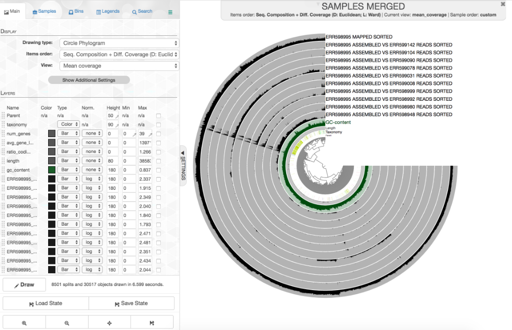

# Computational Biology Workshop 2018 @ Carleton College: Generating metagenome-assembled genomes
Rika Anderson,
Assistant Professor of Biology at Carleton College

**Before we start, please do steps 1-3 to get your data downloaded and unpacked while we go over the Introduction. The data files are pretty big, so it will take some time to download an uncompress them. We can save some time by doing this while we go over some basic concepts together.**

## Introduction to binning
One of the most exciting bioinformatics advances to come out of the world of microbial ecology has been the advent of **binning,** or the recovery of near-complete genomes from environmental sequence datasets called **metagenomes.** This means that we can get the near-complete genome of a microbe without having to get it into culture first-- we can take a scoop of seawater or soil, for example, and pull genomes straight out of that sample.

### Why is this important?

99% of microbes are uncultivated, which means that until now, we were only able to get the genomes of about 1% of the microbial species that exist. With these new bioinformatics techniques, we're now able to access a much wider diversity of the microbial world!

This has already revolutionized our understanding of the diversity of life on Earth-- as well as our own microbial ancestors. New phyla of bacteria and archaea are being discovered and studied with this technique, and a new tree of life was published in 2016. In 2015, researchers used this technique to discover a new type of microbe at a hydrothermal vent. What they discovered was that this particular microbe, named *Lokiarchaea* after the trickster god of Norse mythology, seems to form a bridge between the archea-- which are microbes that often live in extreme environments-- and the eukaryotes, which includes humans. Those researchers have argued that *Lokiarchaea* may hold the clues to understanding our own microbial ancestors.

### How does this work?

Here's an overview:
1. Collect a metagenome.
2. Assemble reads into contigs.
3. Map reads back to contigs.
4. Cluster contigs into bins based on mapping coverage and tetranucleotide frequency.

A **metagenome** is a big tangle of short DNA sequences that were collected from a microbial community. Based on the way DNA sequencers work these days, a metagenome will contain millions of short DNA sequences that are about 200 letters (base pairs) long. Our job is to try to make sense of this tangled mess.

Usually, one of the first things we do is *assembly*. We connect these short sequences (called "reads") and connect them together into longer sequences (called "contigs"). What we're going to do today is cluster those contigs together into genomes.

Genomes are disentangled from metagenomes by clustering reads together according to two properties: **coverage** and **tetranucleotide** frequency. We get coverage from mapping the metagenomic reads to a reference assembly. If contigs have similar coverage patterns between datasets, they are clustered together. Similarly, if contigs have similar "words" (or kmers) that appear over and over again, they will cluster together. When we cluster contigs together like this, we get a collection of contigs that are thought to represent a reconstruction of a genome from your metagenomic sample. We call these 'genome bins,' or 'metagenome-asembled genomes (MAGs).'

There is a lot of discussion in the field about which software packages are the best for making these genome bins. And of course, the one you choose will depend a lot on your dataset, what you’re trying to accomplish, and personal preference. I chose anvi’o because it is a nice visualization tool that builds in many handy features.

I am drawing a lot of information for this tutorial from the anvi'o website. If you'd like to learn more, see the link below.

[anvi'o tutorial] (http://merenlab.org/2016/06/22/anvio-tutorial-v2/)

## Create a contigs database

#### 1. Open Terminal
Boot your computer as a Mac and open the Terminal. If you can't find it, use the magnifying glass in the top right corner.

#### 2. Download the data
Navigate to the Desktop and make a new directory called `anvio`, then change into that directory.

```
cd Desktop
mkdir anvio
cd anvio
```

Right-click on the following links (or Control-click, or click "Save Link as...") to download this data to your computer. (Dragging and dropping won't work.) Move it to the anvi'o directory that you just made.

[Link to data] (http://www.cs.carleton.edu/faculty/loesper/courses/f18_workshop/)

These downloads are MASSIVE files, so this will take about 4 minutes.
The data includes:

1) assembled sequences, called contigs  (i.e. >c_000000000001)
2) bam files, which contain mapping data of metagenomes to your contigs.
3) centrifuge files, which contain information about what types of microbes are in your sample.


#### 3. Unpack the data

After the data is downloaded, you need to uncompress it using this command:
```
tar -xzf all_mapping_files.tgz
```
Then once that is done, please check to see if the files end in .gz or .tgz. If they end in .gz, type this (substitute the name of the file for `xxx`):
```
gunzip xxx.bam
```
If they end in .tgz, use the command above to un-archive and un-zip them.

#### 4. Make contigs database
The first thing you have to do is make a database of your contigs. Contigs are basically sequences that you have assembled together from lots of little short sequences. (I've done that step for you already.) We're going to put all of those assembled sequences into a nice organized database. This database will contain the sequences of your contigs, plus lots of extra information about those contigs.

-`anvi-gen-contigs-database` is the anvi’o script that makes the contigs database.

-`–f` is the fasta file with your contigs that you have already assembled and fixed.

-`–o` provides the name of your new contigs database.

--`--project-name` provides the name of your project. Obviously.


```
anvi-gen-contigs-database -f [your formatted, assembled contigs] -o contigs.db --project-name myproject
```


#### 5. Search for single copy universal genes
Now we will search our contigs for archaeal and bacterial single-copy core genes. This will be useful later on because when we try to disentangle genomes from this metagenome, these single-copy core genes can be good markers for how complete your disentangled genome is.

This process is slow, so we're going to run it on 5 CPUs rather than just 1. It should take a little under 10 minutes. We can talk about contigs and mapping while we wait to make sure we're all on the same page.

```
anvi-run-hmms -c contigs.db -T 5
```

#### 6. Determine taxonomy using Centrifuge
Now we are going to figure out the taxonomy of our contigs using a program called centrifuge. Centrifuge is a program that compares your contigs to a sequence database in order to assign taxonomy to different sequences within your metagenome. We're going to use it first to classify your contigs.

If you would like to know more, go here: http://merenlab.org/2016/06/22/anvio-tutorial-v2/ and here: http://www.ccb.jhu.edu/software/centrifuge/

First, export your genes from anvi'o.
```
anvi-get-sequences-for-gene-calls -c contigs.db -o gene-calls.fa
```


#### 7. Import taxonomy data

 One of the things that's useful to know is what kinds of microbes are in your sample. I have already run a separate program called `centrifuge` that has assigned a taxonomy to your contigs. Now you're going to put that information into your contigs database in anvi'o. It has a parser written into the software that can automatically read and import centrifuge output.

```
anvi-import-taxonomy-for-genes -c contigs.db -i centrifuge_report.tsv centrifuge_hits.tsv -p centrifuge
```

## Incorporating mapping data

#### 8. Copy mapping files
In order to make bins, anvi'o needs to compare mappings from different datasets. So, we mapped reads from a bunch of different metagenomes to these contigs. Each of those mapping files has coverage information that we can use to cluster contigs together-- contigs with similar coverage get clustered together.

To do this, you need both the **sorted .bam files** and the **.bai files**. Those are stored at ``/Accounts/Genomics_Bioinformatics_shared/Tara_mappings/``. Copy the ones you need over to the directory that you are in now.

```
cp /Accounts/Genomics_Bioinformatics_shared/Tara_mappings/[bam and/or bai files you want] .
```

#### 9. Import mapping files into anvi'o with anvi-profile
Now anvi’o needs to combine all of this information—your mapping, your contigs, your open reading frames, your taxonomy—together. To do this, use the anvi-profile script.

-`anvi-profile` is the name of the program that combines the info together
-The `–i` flag provides the name of the sorted bam file that you copied in the step above.
-The `-T` flag sets the number of CPUs. For now, let's set it to 5 so we don't blow up your computer.
-The `-M` flag sets a minimum contig length. In a project for publication, you'd want to use at least 1000, because the clustering of contigs is dependent on calculating their tetranucleotide frequencies (searching for patterns of kmers). You need to have a long enough contig to calculate these frequences accurately. But for our purposes, let's use 500 so you can use as many contigs as possible.
```
anvi-profile -i [your sorted bam file] -c contigs.db -T 5 -M 500
```
**Do this for each of the .bam files you have in your folder.**

#### 10. Merge them together with anvi-merge
Now merge all of these profiles together using a program called anvi-merge. You have to merge together files in directories that were created by the previous profiling step. The asterisk * is a wildcard that tells the computer, 'take all of the folders called 'PROFILE.db' from all of the directories and merge them together.'

We're also going to tell the computer not to bin these contigs automatically (called 'unsupervised' binning), we want to bin them by hand ('supervised' binning). So we use the --skip-concoct-binning flag.

This step will take a couple minutes.
```
anvi-merge all_mapping_files/*/PROFILE.db -o SAMPLES-MERGED -c contigs.db --skip-concoct-binning
```
## Visualizing and making your bins

#### 13. anvi-interactive
Now the fun part with pretty pictures! Type this to open up the visualization of your contigs:
```
anvi-interactive -p SAMPLES-MERGED/PROFILE.db -c contigs.db
````

Cool, eh?

Click 'Draw' to see your results! You should see something like this:


*What you are looking at:*

-the tree on the inside shows the clustering of your contigs. Contigs that were more similar according to k-mer frequency and coverage clustered together.

-the rings on the outside show your samples. Each ring is a different sample. There is one black line per contig. The taller the black line, the more mapping for that contig.

-the 'taxonomy' ring shows the centrifuge designation for the taxonomy of that particular contig.

-the 'GC content' ring shows the average percent of bases that were G or C as opposed to A or T for that contig.

-the 'ribosomal' ring shows you hits for ribosomal RNA. This is a kind of gene that every microbial genome should have (in theory).

#### 15. Make bins
We will go over the process for making bins together in class.

Because your datasets are fairly small, your bins are also going to be very small. Your percent completeness will be very low. Try to identify ~3-5 bins according to patterns in the mapping of the datasets as well as the GC content.

When you are done making your bins, be sure to click on 'Store bin collection', give it a name ('my_bins' works), and then click on 'Generate a static summary page.' Click on the link it gives you. It will provide lots of information about your bins. In the boxes under the heading 'taxonomy,' you can click on the box to get a percentage rundown of how many contigs in your bin matched specific taxa according to centrifuge, if any matched.


#### 16. Finding bin information
You will find your new bin FASTA files in the directory called '~/Desktopy/anvio/SAMPLES-MERGED/SUMMARY_my_bins'.

`bins_summary.txt` provides just that, with information about the taxonomy, total length, number of contigs, N50, GC content, percent complete, and percent redundancy of each of your bins. This is reflected in the summary html page you generated earlier when you clicked 'Generate a static summary page.'

If you go to the directory `bin_by_bin`, you will find a series of directories, one for each bin you made. Inside each directory is a wealth of information about each bin. This includes (among other things):

-a FASTA file containing all of the contigs that comprise your bin (i.e. `Bin_1-contigs.fa`)

-mean coverage of each bin across all of your samples (i.e. `Bin_1-mean-coverage.txt`)

-files containing copies of single-copy, universal genes found in your contigs (i.e. `Bin_1-Rinke_et_al_hmm-sequences.txt` and `Bin_1-Campbell_et_all-hmm-sequences.txt`

-information about single nucleotide variability in your bins-- the number of SNVs per kilobasepair. (i.e. `Bin_1-variability.txt`)

##  What do I do with these bins?

OK. You have some bins. Great, now what?

Let's take a moment and appreciate what you did. The sequences you started with contained millions of tiny bits of DNA from a random hodgepodge of bacteria. You just pulled together nearly complete genomes out of that mess. **ISN'T THAT AMAZING??**

Now that we've appreciated how cool that is, there are a few things we could continue to do with these genomes if we were scientists studying the oceans (like me!)

#### 17. Look at their gene content

We can see what types of genes were in these genomes simply by inspecting our summary page. After you click "generate static gene summary" on the anvi'o visualization page, a new page will pop up giving you lots of info about what types of genes are on those genomes. Take a look and see what you find. Different types of microbes have different types of abilities, and this is giving you a glimpse into their functional potential.


#### 18. Look at the variation within the microbial populations

We can also see how these populations are *evolving* over time by looking at how much variation there is within the population. It's sort of like Darwin's finches: some finch populations had beaks with all the same size and shape, and some populations had different beak shapes and sizes, probably because there were seeds of different shapes and sizes in that habitat. Our equivalent here is single nucleotide variants, or SNVs. You can look at the SNVs by examining the `SAMPLES-MERGED/SUMMARY_my_bins/bins_across_samples/variability.txt`
file that you generated when you made the sample summary page. It has tons of information about how many SNVs there were for each of your bins.

Bins with lots of SNVs are probably highly variable, whereas bins with very few SNVs may have just bloomed in the environment, or may have just undergone an extinction event.


#### 19. And so on
There are a ton of other things you can do in anvi'o. A brand new features that just rolled out is that you can look at the actual structure of a protein and figure out where the SNVs are on that protein structure, so you can figure out if the SNV is somewhere important, like the active site of a protein, or somewhere less important. anvi'o is a pretty powerful piece of software that is continuing to change as bioinformatics methods change week by week. We're at the pioneering edge of biology, and while it can be overwhelming, it's always exciting.
