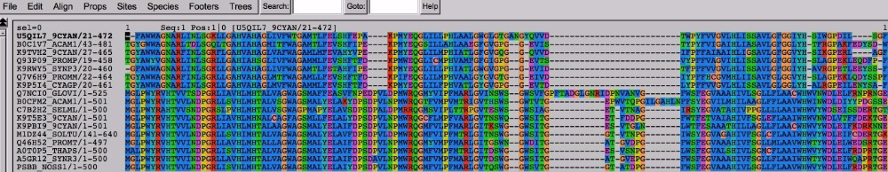

# Week 3: Local alignments and sequence search with BLAST, global alignments with MUSCLE, and making trees with RAxML

Rika Anderson,
Carleton College


## Logging in to the remote server

#### 1. Login
If you're in a lab on campus, boot as a Mac on the lab computer.

#### 2. Terminal
Find and open the Terminal application (`Applications/Utilities`). If you're on a PC, open your Ubuntu terminal or your PuTTY terminal.

#### 3. Connect to baross

Log on to the server using your Carleton username and password.

```bash
ssh [username]@baross.its.carleton.edu
```


## Using BLAST

Last week, we annotated thousands of ORFs in one go. As awesome as that was, you may have noticed that there were a lot of proteins labeled as "hypothetical." Let's see if we can learn more about some of those genes by using BLAST, which is a tool that every bioinformatician should have in their toolkit.

#### 4. Copy sequence of your first hypothetical ORF

Will use BLAST to compare your sequences against the National Center for Biotechnology Information (NCBI) non-redundant database of all proteins. This is a repository where biologists are required to submit their sequence data when they publish a paper. It is very comprehensive and well-curated.

Change directory into your toy dataset Prokka results, and take a look at your Prokka amino acid sequence file again using the program `less`. (Again, substitute the actual names of your Prokka folder and files. Use tab complete as a shortcut!)

```
cd toy_dataset_directory/ORF_finding/prokka_toy
less PROKKA_09252018.faa
```

Copy the sequence of the **third** ORF in your file, the first one labeled as a 'hypothetical protein'. You can include the first line that includes the `>` symbol.

#### 5. Navigate to NCBI site

Navigate your web browser to the [BLAST suite home page](https://blast.ncbi.nlm.nih.gov/Blast.cgi). Select Protein BLAST (blastp).

#### 6. Paste sequence

Copy your sequence in to the box at the top of the page, and then scroll to the bottom and click “BLAST.” Give it a few minutes to think about it.

#### 7. Run BLAST via the web browser

While that's running, open a new tab in your browser, navigate to the BLAST suite home page, and try blasting your protein using `tblastn` instead of `blastp`.

*What’s the difference?*

`blastp` is a protein-protein blast. When you run it online like this, you are comparing your protein sequence against the National Centers for Biotechnology Information (NCBI) non-redundant protein database, which is a giant database of protein sequences that is “non-redundant”—that is, each protein should be represented only once.

In contrast, `tblastn` is a translated nucleotide blast. You are blasting your protein sequence against a translated nucleotide database. When you run it online like this, you are comparing your protein sequence against the NCBI non-redundant nucleotide database, which is a giant database of nucleotide sequences, which can include whole genomes.

Isn't this a BLAST?!?
(Bioinformatics jokes! Not funny.)

#### 8. Post-lab questions

For your post-lab assignment, answer the following questions in a Word document that you will upload to the Moodle:

**Question 1: Check for understanding:**

 Take a look at your results from blastp and tblastn. In your own words, what is the difference between the two, and why do the results look different? Explain in what scenarios you might choose to use blastp over tblastn.


### Doing a BLAST against your own dataset
We just learned how to compare a sequence of interest against all proteins in the NCBI database. But let's say you just isolated a protein sequence that you're interested in, and want to know if any of the ORFs or contigs in your dataset has a match to just that sequence. In that case, you would want to blast against your own sequence set, not against the giant NCBI database. Here's how you do that.

First, make sure you are in the correct directory.

```
cd ~/toy_dataset_directory/ORF_finding/prokka_toy
```

#### 9. Make blast database
Turn your ORF dataset into a BLAST database. Here is what the flags mean:

- `makeblastdb` invokes the command to make a BLAST database from your data
- `-in` defines the file that you wish to turn into a BLAST database
- `-dbtype`: choices are "prot" for protein and "nucl" for nucleotide.

```
makeblastdb -in PROKKA_09252018.faa -dbtype prot
```

#### 10. Find protein
Your ORFs are ready to be BLASTed. Now we need a protein of interest to search for. Let's say you are interested in whether there are any close matches to CRISPR proteins in this dataset. The Pfam database is a handy place to find 'seed' sequences that represent your protein of interest. Navigate your browser to [this Pfam website](http://pfam.xfam.org/family/PF03787).

This takes you to a page with information about the RAMP family of proteins, the "Repair Associated Mysterious Proteins." While indeed mysterious, they turn out to be CRISPR-related proteins.

#### 11. Find protein (cont.)
Click on "2871 sequences" near the top. If the link doesn't work, click on "Alignments" on the side bar.

#### 12. Generate file
Under "format an alignment," select your format as "FASTA" from the drop-down menu, and select gaps as "No gaps (unaligned)" from the drop-down menu. Click "Generate."

#### 13. View file
Take a look at the Pfam file using less or using a text editing tool on the local computer. It is a FASTA file with a bunch of “seed” sequences that represent a specific protein family from different organisms. If you want to learn more about a specific sequence, you can take the first part of the fasta title (i.e. “Q2JRT5_SYNJA”) and go to [this website](http://www.uniprot.org/uploadlists/) and paste it in the box. Then select from “UniProt KB AC/ID” to “UniProtKB” in the drop-down menu on the bottom (this should be the default). You will get a table with information about your protein and which organism it comes from (in this case, a type of bacterium called *Synechococcus*).

#### 14. Transfer file
We need to put the file that you downloaded to your local computer onto the remote server. As a reminder, we do this using `scp` (secure copy). It lets you copy files to and from your local computer on the command line. You have to know the path to the file you want to copy on baross, and the path to where you want to put it on your local computer. It's a lot like cp, except it allows you to copy things between computers.

Open up a new Terminal window, but **DON'T** log in to baross on that one. Navigate to wherever your PFAM file is, then copy it onto the server. We're going to put the file in your ORF_finding directory:

```
cd ~/Downloads
scp PF03787_seed.txt [username]@baross.its.carleton.edu:~/toy_dataset_directory/ORF_finding/prokka_toy
```
It will ask you for your password; type it in and hit "Enter."


#### 15. BLAST it
Now, BLAST it! There are many parameters you can set. The following command illustrates some common parameters.

```bash
blastp -query PF03787_seed.txt -db PROKKA_09252018.faa -evalue 1e-05 -outfmt 6 -out PF03787_vs_toy_ORFs.blastp
```

- `blastp` invokes the program within the blast suite that you want. (other choices are `blastn`, `blastx`, `tblastn`, `tblastx`.)
- `-query` defines your blast query-- in this case, the Pfam seed sequences for the CRISPR RAMP proteins.
- `-db` defines your database-- in this case, the toy assembly ORFs.
- `-evalue` defines your maximum e-value, in this case 1x10-5
- `-outfmt` defines the output format of your blast results. option 6 is common; you can check out [this link](https://www.ncbi.nlm.nih.gov/books/NBK279675/) for other options.
- `-out` defines the name of your output file. I like to title mine with the general format `query_vs_db.blastp` or something similar.


#### 16. Examine results
Now let's check out your blast results. Take a look at your output file using `less`. (For easier visualization, you can also either copy your results (if it’s a small file) and paste in Excel, or transfer the file using `scp` and open it in Excel.)


#### 17. Column descriptions
Each blast hit is listed in a separate line. The columns are tabulated as follows, from left to right:

1. query sequence name
2. database sequence name
3. percent identity
4. alignment length
5. number of mismatches
6. number of gaps
7. query start coordinates
8. query end coordinates
9. subject start coordinates
10. subject end coordinates
11. e-value
12. bitscore


#### 19. BLAST comparison
Let’s try this another way. Run your blast again, but this time use a bigger e-value cutoff.

```bash
blastp -query PF03787_seed.txt -db PROKKA_09252018.faa -evalue 1e-02 -outfmt 6 -out PF03787_vs_toy_ORFs_evalue1e02.blastp
```

Answer the following question on the Word document you will submit to Moodle:

**Question 2: Check for understanding:**
In a few sentences/a short paragraph, describe:
How do these BLAST results differ from your previous BLAST?
What can you infer about what the e-value is based on these results?
Explain in your own words why you might choose to use this method of BLAST (with a query sequence against your own dataset) rather than BLAST a query sequence against the nr database on the NCBI BLAST website.

#### 20. Try another gene

Now let’s try a different gene. Pfam is a good place to find general protein sequences that are grouped by sequence structure, with representatives from many different species. Let’s say you’re interested in finding a specific sequence instead.

1. Go to the [NCBI Protein database](https://www.ncbi.nlm.nih.gov/protein/).
2. Let’s look for the DNA polymerase from *Thermus aquaticus*, the famous DNA polymerase that is used in PCR. Type “DNA polymerase Thermus aquaticus’ in the search bar at the top.
3. Click on the first hit you get. You’ll see lots of information related to that sequence.
4. Click on “FASTA” near the top. It will give you the FASTA sequence for that protein (protein rather than DNA).
5. Copy that sequence and paste it into a new file on baross. Here is one way to do that: use `nano` to create a new file (see command). Once in `nano`, paste your sequence into the file. Type `Ctrl+O`, `Enter`, and then `Ctrl+X`.


```bash
nano DNA_pol_T_aquaticus.faa
```

#### 21. BLAST

Now you have a sequence file called `DNA_pol_T_aquaticus.faa`. BLAST it against your toy dataset:

```bash
blastp -query DNA_pol_T_aquaticus.faa -db PROKKA_09252018.faa -outfmt 6 -out DNA_pol_T_aq_vs_toy_ORFs.blastp
```

#### 22. Examine results

Take a look at your blastp output using less. Notice the e-value column, second from right. Most of your e-values for this range between 2.3 (at best) and 7.4 (at worst). These e-values are TERRIBLE. This means you probably didn’t have very good hits to this protein in your dataset. (What constitutes a “good” e-value is debatable and depends on your application, but a general rule of thumb is for it to be 1e-05 or lower.)

#### 23. Post-lab questions

Now choose your own protein and BLAST it against your dataset. **Answer the following questions on the Moodle Word document:**

**Question 3: Check for understanding:**

In a few sentences/a short paragraph, describe the protein you chose and how you found the sequence for that protein. Show the command you executed for the blast, and show the first three matches (if there were any) with an e-vaue cutoff above 1e-05.


## Making An Alignment

OK, so we've learned how to do sequence search using BLAST, which is a *local* alignment search tool. Now we're going to learn how to make global alignments using MUSCLE, and then use those *global* alignments to make phylogenetic trees in order to learn about how genes are related.

We’ll start by creating a multiple sequence alignment with MUSCLE, and then we will make bootstrapped maximum likelihood phylogenetic trees with RAxML. We’ll use the Newick files generated by RAxML to visualize trees in an online tree visualization tool called the Interactive Tree of Life (iToL). We’ll do this using toy datasets, and then try out some trees on your project datasets.

#### 24. Aligning sequences
First we have to make a multiple sequence alignment with the sequences we wish to make into a tree. This could include any gene of interest. We’re going to start by aligning a toy dataset made of genes that are part of photosystem II in photosynthesis. This file contains many sequences of the same photosystem II protein from different species.

Make a new directory within your toy dataset directory for making alignments and trees, then copy the toy dataset from the data directory to your toy dataset directory.
```
mkdir toy_dataset_directory/alignments_and_trees
cd toy_dataset_directory/alignments_and_trees
cp /usr/local/data/toy_datasets/toy_dataset_PSII_protein.faa .
```

#### 25. Align with MUSCLE
Now, we make a multiple sequence alignment using `muscle`. `muscle` uses dynamic programming to make global alignments of multiple sequences, like we did in class. It’s remarkably easy and fast.
```
muscle -in toy_dataset_PSII_protein.faa -out toy_dataset_PSII_protein_aligned.afa
```

What this means:

`muscle` is the name of the alignment program

`-in` defines the name of your input file, which can be either DNA or protein

`-out` defines the name of your output file. I like to give them an easy-to-recognize name with the extension `.afa`, which stands for “aligned fasta file.”

#### 26. Secure copy to a local computer
Let’s take a look at your alignment. I like to use the program Seaview to do this, and Seaview should be on your local computer (if not, go back to the Week 1 pre-lab for instructions). You will have to copy your file to your local computer using `scp.` (As before, substitute `[username]` with your own username.)

 ```
 scp [username]@baoss.its.carleton.edu:/Accounts/[username]/toy_dataset_directory/alignments_and_trees/toy_dataset_PSII_protein_aligned.afa ~/Desktop
```
This lets you securely copy the aligned protein file from baross to your local computer. Substitute [username] with your own username.

If you wanted to securely copy any file from your local computer to baross, use the command below. It's easy to find the path of where you want to put things-- simply navigate to where you want to put it on the server, and then either copy everything before the $ or just type `pwd`.

```
scp ~/Desktop/[some_file.txt] [username]@baross.its.carleton.edu:[path_of_your_destination_directory]
```


#### 27. Visualize with Seaview
Open the application called “Seaview” and drag your file over to the alignment window. You should see something like this.



Seaview shows the names of the sequences to the left. The letters to the right are the amino acids in your sequence, color-coded to make the alignment easier to see. You can easily see that some regions of the sequence are more highly conserved than others, and that some species appear to have an insertion or deletion in specific regions of the sequence. Note that this is an amino acid alignment, not a nucleotide alignment. (You could easily use MUSCLE to align nucleotides as well.)


## Making a Tree
Now we’re going to turn this alignment into a phylogenetic tree. We’re going to use a software package called RAxML, which is a commonly used tree-building software package that uses the maximum likelihood method to build trees.

#### 28. Formatting
First, we have to convert the aligned fasta file into a format that the tree-building software (RAxML) can handle. (A lot of the work of a bioinformatician is converting files from one format into the other.) I wrote a small Python script to convert your aligned fasta (.afa) file into Phylip file (.phy), which is what RAxML requires for input. Invoke it with the name of the script, followed by the aligned fasta file that you’d like to convert, like this:

```
convert_afa_to_phy.py toy_dataset_PSII_protein_aligned.afa
```
#### 29. Looking at your Phylip file
The script should have outputted a file that ends in .phy. Take a look at it to see what the format looks like.


The top of a Phylip file indicates the number of sequences (in this case, 17) and the number of base pairs in the aligned sequences (571). It’s followed by the first 54 bases of each sequence, broken up by a space every 10 letters. Every new line shows a new sequence (from a different species or organism). The next 54 letters of each sequence starts after the first set, and continues like this for the rest of the file. (Yes, it’s weird, but a lot of tree-building programs use this format.)

```
less toy_dataset_PSII_protein_aligned.afa.phy
```

### 30. Build your tree!
Now let’s make a tree. Type this:

```
raxmlHPC-PTHREADS-AVX -f a -# 20 -m PROTGAMMAAUTO -p 12345 -x 12345 -s toy_dataset_PSII_protein_aligned.afa.phy -n toy_dataset_PSII_protein.tree -T 4

```

What this means:

`-raxmlHPC-PTHREADS-AVX` is the name of the software package. This one is configured for the processors that are specific to this server.

`-f a` allows for rapid bootstrapping. This means RAxML will do a maximum likelihood search based on your protein sequences, and then bootstrap it as many times as you wish.

`-# 20` tells the program to bootstrap 20 times.

`-m PROTGAMMAAUTO` tells the program that these are protein sequences, and tells the program how to model protein evolution. To get into this is beyond the scope of this class, but fortunately RAxML is able to automatically choose the best one for us based on the number of sequences and the type of data we have.

`-p` and `–x` provide seed numbers so that the program can generate random numbers for the bootstrapping process.

`-s` gives the name of your input Phylip file

`-n` gives the name of your output Newick file, which will be made into a tree.

`-T` determines the number of threads. This is sort of like determining how many processors you'll use up for this process. Today, we'll use 4. Please don't use more than this without asking first.


NOTE: "bootstrapping" is a statistical test used to assess the reliability of your tree topology (its shape). We'll talk about this more in class next week.

#### 31. Tree output

You’ve made a tree! Congratulations! Let’s look at the raw RAxML output. You should have some files called:

`RAxML_bestTree.toy_dataset_PSII_protein.tree`
`RAxML_bipartitionsBranchLabels.toy_dataset_PSII_protein.tree`
`RAxML_bipartitions.toy_dataset_PSII_protein.tree` <-- this is the one you want, because it gives you bootstrap values at the nods on the tree. (more on bootstrapping next week.)
`RAxML_bootstrap.toy_dataset_PSII_protein.tree`
`RAxML_info.toy_dataset_PSII_protein.tree`

Take a look at the bipartitions file using `less`.

This is a Newick file, and it’s a common format for phylogenetic trees.

#### 32. Visualizing the tree
Copy your Newick file (toy_dataset_PSII_protein.tree) to your local computer using `scp`. Open up a web browser on your local computer and navigate to the [IToL website](http://itol.embl.de/) and create an account for yourself.

Click on “Upload tree files” and find your tree file and upload it.

Click on your tree. You should see it open in your window. You can play around with the settings on the right—you can make it circular or normal, you can display the bootstrap values as symbols or as text, and if you click on the leaves (the tips) or the nodes (the interior bifurcations) of the tree, you can color code them. Play around with it, and then click on the “Export” tab, choose the PDF format, and click “Export.” It should pop up in a new tab. Download it and include it in your postlab writeup this week as “Figure 1.” Be sure to include a figure caption.

## Asking Biological Questions with Trees
Now that you know how to make an alignment, create a phylogenetic tree, and visualize it, we’re going to ask a biological question that can be answered with trees:

**What evolutionary clade do photosynthesis genes from surface waters fall into?**

We would probably expect to see more photosynthesis genes related to photosynthetic bacteria, and perhaps seaweed, in the surface oceans, but not photosynthesis genes related to terrestrial plants. We can make a phylogenetic tree to determine whether that's true, and which specific organisms they're most closely related to.

#### 33. Exploring the KEGG database
First, we need to identify a target protein within the photosynthetic apparatus. For this, let's go to the KEGG Pathways website, which has a description of major metabolic pathways and the proteins that comprise them. It's a lot like the COG database, but better updated, and with a lot more information.

[Link to KEGG database](http://www.genome.jp/kegg/pathway.html)

Click on 'Energy' under 'Metabolism' and then click on 'Photosynthesis.' You should see a depiction of the photosynthetic proteins. Let's choose a protein within the photosynthetic apparatus that might be of interest. For the sake of this example, let's choose psbA: it's part of the photosystem II p680 reaction center D protein. Click on the box labeled 'PsbA' beneath the figure. Now you'll see lots of information about that particular gene. You can use the KEGG website like this to figure out which proteins or genes might be of interest for your projects later on.

#### 34. Getting some sequences from Pfam
However, it will be more useful for us to have a nice set of seed sequences to align against-- so let's go back to Pfam. Click on this [link](http://pfam.xfam.org/family/PF00124).

Click on '1953' sequences near the top click on 'FASTA' from the dropdown menu, click 'No gaps (unaligned)' from the drop-down menu, and save the resulting file on baross within a new directory in your toy dataset directory. It would probably be best to create a separate folder for this. Use scp to transfer it over to that new directory, or you could copy the file and create a new file on baross using nano and copy it there (many options!).

```
cd
mkdir toy_dataset_directory/tree_exercise_1
cd toy_datset_directory/tree_exercise_1
```

#### 35. Copy Tara data

First we have to find matches to that gene in our dataset. So, we have to BLAST this dataset against the dataset of interest. We're going to use ORFs from a Tara Oceans dataset from the North Atlantic surface oceans off the East Coast. Copy it over to your current directory.

```
cp /usr/local/data/toy_datasets/ERR598983_ORFs.faa .
```

#### 36. Make BLAST database
Make this dataset into a BLAST database.

```
makeblastdb -in ERR598983_ORFs.faa -dbtype prot
```

#### 37. BLAST

BLAST it.
```
blastp -query PF00124_seed.txt -db ERR598983_ORFs.faa -outfmt 6 -evalue 1e-05 -out PF00124_vs_ERR598983_ORFs.blastp
```

#### 38. Look at BLAST results
Take a look at the results. You'll notice lots of hits. However, you'll see that all of the hits were to a single ORF: contig-100_83_1.

```
less PF00124_vs_ERR598983_ORFs.blastp
```

#### 39. Search and copy from terminal using less
Let's extract it. Open up the original file with the open reading frames, and copy the sequence for contig-100_83_1.

```
less ERR598983_ORFs.faa
```

You can search for a specific contig by typing:
`/contig-100_83_1`

#### 40. Add to FASTA file
Now let's add it to the original Pfam file and make a tree from all of those sequences. First, make a copy of the original Pfam file and give it a new name. Then use nano to open it up and paste the ORF sequence to the bottom.

```
cp PF00124_seed.txt PF00124_seed_plus_new_ORF.fasta
nano PF00124_seed_plus_new_ORF.fasta
```

#### 41. Align with MUSCLE
Make a multiple sequence alignment with `muscle`.

```
muscle -in PF00124_seed_plus_new_ORF.fasta -out PF00124_seed_plus_new_ORF_aligned.afa
```

#### 42. Convert to Phylip
Convert your aligned FASTA file to a Phylip file.

```
convert_afa_to_phy.py PF00124_seed_plus_new_ORF_aligned.afa
```

#### 43. Make tree
Make your tree. When it's done, open it up in IToL and make a pretty tree image. (The RAxML run might take a few minutes, so you might get started on the last question for the day while this runs.)

```
raxmlHPC-PTHREADS-AVX -f a -# 20 -m PROTGAMMAAUTO -p 12345 -x 12345 -s PF00124_seed_plus_new_ORF_aligned.phy -n PF00124_seed_plus_new_ORF.tree -T 4
```

#### 44. Visualize with ITOL
Visualize your tree with ITOL.

#### 45. Postlab questions: Check for understanding

Include an image of your tree and call it 'Figure 2.' Include a figure caption.


## Post-lab assignment

For your post-lab assignment, compile all of the Moodle questions above into a single document. There are three 'check for understanding' questions listed above, and two figures. In addition, answer the critical thinking question below.

**Critical thinking question:**

Develop a question about your project dataset that you can answer using BLAST, making trees, or both. For example, your question could be something like: 'how many ORFs in my dataset have a match to a specific type of photosynthesis gene?' or 'I found a cytochrome c gene in my dataset. Where does it fit on a tree of other cytochrome C genes from Pfam?'

*For this week's postlab assignment, describe:*

-What question did you ask?

-How did you go about answering it? (Write this like you would a mini Materials and Methods section: include which databases you searched, which software packages you used, and which important flags you used in your commands. You should include enough information for an intelligent researcher to be able to replicate your results.)

-What were your results? Describe them. (Write this like you would a mini Results section. Include a figure if appropriate.)

-What does this tell you about your project dataset? (Think of this as a mini Discussion section: I'm looking for evidence that you thought about your results and how they connect more broadly to some ecological or evolutionary pattern in your dataset.)

Compile all of this together into a Word (or similar) document and submit via Moodle by lab next week. **I prefer to grade these blind, so please put your student ID number, rather than your name, on your assignment. (This applies to all future assignments as well.)**
