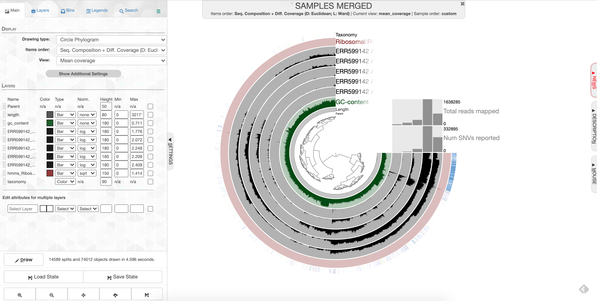
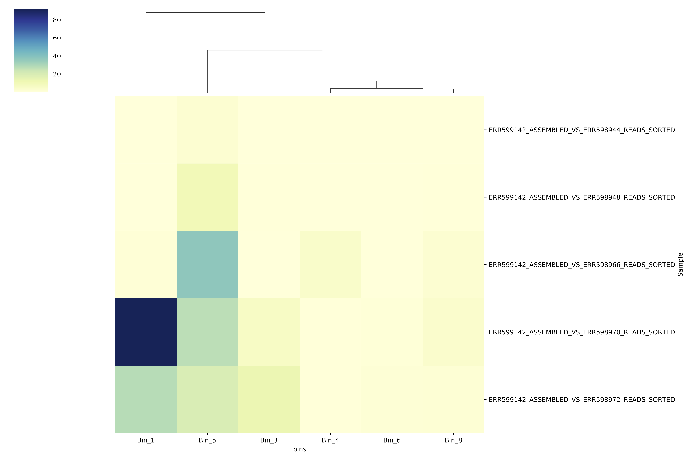
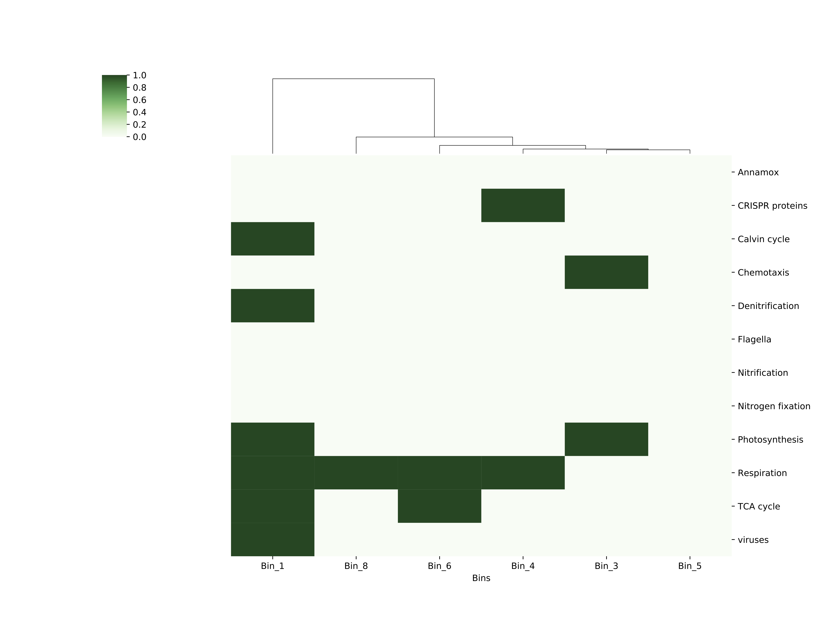

# Week 5: Binning genomes with anvi'o

## Intro (Rika will go over this at the beginning of lab)
This week in lab we’ll learn how disentangle individual microbial genomes from your mess of metagenomic contigs. We aren’t going to use a toy dataset this week—-we’re going straight into analysis with your metagenome datasets for your projects.

Genomes are disentangled from metagenomes by clustering reads together according to two properties: **coverage** and **tetranucleotide** frequency. Basically, if contigs have similar coverage patterns between datasets, they are clustered together; and if contigs have similar kmers, they will cluster together. When we cluster contigs together like this, we get a collection of contigs that are thought to represent a reconstruction of a genome from your metagenomic sample. We call these 'genome bins,' or 'metagenome-asembled genomes' (MAGs).

There is a lot of discussion in the field about which software packages are the best for making these genome bins. And of course, the one you choose will depend a lot on your dataset, what you’re trying to accomplish, and personal preference. I chose anvi’o because it is a nice visualization tool that builds in many handy features.

I am drawing a lot of information for this tutorial from the anvi'o website. If you'd like to learn more, see [this link](http://merenlab.org/2016/06/22/anvio-tutorial-v2/).

## Preparing your contigs database for anvi'o
#### 1. ssh tunnel
Boot your computer as a Mac and use the Terminal to ssh in to baross. Anvio requires visualization through the server, so this week we have to create what is called an "ssh tunnel" to log into the server in a specific way. Substitute "username" below with your own Carleton login name.

NOTE: Each of you will be assigned a different port number (i.e. 8080, 8081, 8082, etc.). Substitute that number for the one shown below.

```
ssh -L 8080:localhost:8080 username@baross.its.carleton.edu
```

#### 2. Make new folder
Make a new directory called “anvio” inside your project folder, then change into that directory.

```
cd project_directory
mkdir anvio
cd anvio
```

#### 3. Copying data

Last week, we learned how to make BAM files. This week, we'll need them to make our bins, because they give us coverage information. You need BAM files that show the coverage of your own reads mapped against your own contigs, as well as other BAM files showing other people's reads mapped against your contigs.

Fortunately for you, I made all of these BAM files for you ahead of time. They are in this folder:

/workspace/data/Genomics_Bioinformatics_shared/Tara_mappings

Choose **three** mapping files from that folder. The ones you choose should all be from your own dataset. The names are like this, as an example:

`ERR599021_assembled_vs_ERR599013_reads_sorted.bam`

Where ERR599021 is the reference, and reads from ERR599013 were mapped to it. You want only the bam files with your **own** sample number as the **reference**.

You should also include the bam file of your own reads mapped against your own contig.

```
cp [path to sorted .bam files] .
cp [path to sorted .bai files] .
```

For example:
```
cp /workspace/data/Genomics_Bioinformatics_shared/Tara_mappings/ERR599021_assembled_vs_ERR599021_reads_sorted.bam
cp /workspace/data/Genomics_Bioinformatics_shared/Tara_mappings/ERR599021_assembled_vs_ERR599021_reads_sorted.bam.bai
cp /workspace/data/Genomics_Bioinformatics_shared/Tara_mappings/ERR599021_assembled_vs_ERR599013_reads_sorted.bam
cp /workspace/data/Genomics_Bioinformatics_shared/Tara_mappings/ERR599021_assembled_vs_ERR599013_reads_sorted.bam.bai
cp /workspace/data/Genomics_Bioinformatics_shared/Tara_mappings/ERR599021_assembled_vs_ERR599075_reads_sorted.bam
cp /workspace/data/Genomics_Bioinformatics_shared/Tara_mappings/ERR599021_assembled_vs_ERR599075_reads_sorted.bam.bai
```

Finally, copy your contigs over as well. They are probably in your assembly directory. For example:
```
cp ../ERR598983_assembly/ERR598983_assembled_reformatted.fasta .
```

#### 4. Get gene calls and annotations from Prokka
The first thing you have to do is make contigs database, which contains the sequences of your contigs, plus lots of information about those contigs. This includes information from Prokka-- so we have to take the information from Prokka and put it in our contigs database.

First, you have to run a script on your Prokka files to convert them into a text file that we can import into anvi'o. Navigate to wherever your Prokka results are for your project assembly, and run a script to extract information from that file. Then copy it to your anvi'o folder and change directory to your anvio folder. For example:

```
cd prokka_project
gff_parser.py PROKKA_10072018.gff --gene-calls prokka-gene-calls.txt --annotation prokka-gene-annot.txt
cp gene_calls.txt ../../anvio
cp gene_annot.txt ../../anvio
cd ../../anvio
```


#### 5. Make the contigs database

Now, you make the contigs database. It will have lots of information about... well... your contigs.

-`anvi-gen-contigs-database` is the anvi’o script that makes the contigs database.

-`–f` is the fasta file with your contigs that you have already assembled and fixed.

-`–o` provides the name of your new contigs database.

-`external_gene_calls` provides the name of the Prokka file you just made so you can import the Prokka calls into your contigs database

-`--ignore-internal-stop-codons` will ignore any internal stop codons in your gene calls. Sometimes these will get included in your Prokka results by accident, but for our purposes we can ignore them.

```
anvi-gen-contigs-database -f [your formatted, assembled contigs] -o contigs.db --external-gene-calls prokka-gene-calls.txt --ignore-internal-stop-codons
```

#### 6. Import the Prokka annotations
Import your prokka results like this:
 ```
 anvi-import-functions -c contigs.db -i prokka-gene-annot.txt
 ```

#### 7. Search for single copy universal genes
Now we will search our contigs for archaeal and bacterial single-copy core genes. This will be useful later on because when we try to disentangle genomes from this metagenome, these single-copy core genes can be good markers for how complete your genome is.

This process is slow, so we're going to run it on 5 CPUs rather than just 1. You can run it on screen in the background while you move forward with step 6. It should take a little under 10 minutes.

```
screen
anvi-run-hmms -c contigs.db -T 5
```

#### 8. Determine taxonomy using Centrifuge
Now we are going to figure out the taxonomy of our contigs using a program called centrifuge. Centrifuge is a program that compares your contigs to a sequence database in order to assign taxonomy to different sequences within your metagenome. We're going to use it first to classify your contigs.

If you would like to know more, you can visit the [anvi'o tutorial](http://merenlab.org/2016/06/18/importing-taxonomy/#centrifuge) and the [Centrifuge website](http://www.ccb.jhu.edu/software/centrifuge/).

First, export your genes from anvi'o.
```
anvi-get-sequences-for-gene-calls -c contigs.db -o anvio-gene-calls.fa
```

#### 9. Run Centrifuge
```
centrifuge -f -x /usr/local/CENTRIFUGE/p_compressed anvio-gene-calls.fa -S centrifuge_hits.tsv
```

#### 10. Import Centrifuge data
Now import those centrifuge results for your contigs back in to anvi'o. Anvi'o can automatically read and import centrifuge output.
```
anvi-import-taxonomy-for-genes -c contigs.db -i centrifuge_report.tsv centrifuge_hits.tsv -p centrifuge

```

#### 11. Run single copy gene taxonomy
Now we're going to run one more thing to help us better determine the taxonomy of your MAGs.
```
anvi-run-scg-taxonomy -c contigs.db --scgs-taxonomy-data-dir /Accounts/Space_Hogs_shared/anvio-scg-databases/
```

## Incorporating mapping data

We've just decorated our contigs database with all kinds of things. Now, we incorporate all of the BAM files.

#### 12. Import mapping files into anvi'o with anvi-profile
Now anvi’o needs to combine all of this information (your mapping, your contigs, your open reading frames, and your taxonomy) together. To do this, use anvi-profile.

-`anvi-profile` is the name of the program that combines the info together

-The `–i` flag provides the name of the sorted bam file that you copied in the step above.

-The `-T` flag sets the number of CPUs. There are 11 of you, and 96 to spare. For now, let's set it to 5 so we don't blow up the server.

-The `-M` flag sets a minimum contig length. In a project for publication, you'd want to use at least 1000, because the clustering of contigs is dependent on calculating their tetranucleotide frequencies (searching for patterns of kmers). You need to have a long enough contig to calculate these frequencies accurately. But for our purposes, let's use 500 so you can use as many contigs as possible.
```
anvi-profile -i [your sorted bam file] -c contigs.db -T 5 -M 500
```

**Do this for each of your sorted bam files.**

#### 13. Merge them together with anvi-merge
Now merge all of these profiles together using a program called anvi-merge. You have to merge together files in directories that were created by the previous profiling step. The asterisk * is a wildcard that tells the computer, 'take all of the folders called 'PROFILE.db' from all of the directories and merge them together.'

We're also going to tell the computer not to bin these contigs automatically (called 'unsupervised' binning), we want to bin them by hand ('supervised' binning). So we use the --skip-concoct-binning flag.

This step will take a couple minutes.
```
anvi-merge */PROFILE.db -o SAMPLES-MERGED -c contigs.db
```
## Visualizing and making your bins

#### 14. anvi-interactive
Now the fun part with pretty pictures! Type this to open up the visualization of your contigs (of course, change the port number to the one you were assigned):
```
anvi-interactive -p SAMPLES-MERGED/PROFILE.db -c contigs.db -P 8080
````

#### 15. Visualize in browser
Now, open up a browser (Chrome works well) and type this into the browser window to stream the results directly from the server to your browser. NOTE that each of you will be assigned a different port number (i.e. 8080, 8081, 8082, etc); use the one you logged in with in the first step.

http://localhost:8080

Cool, eh?

Click 'Draw' to see your results! You should see something like this:


What you are looking at:

-the tree on the inside shows the clustering of your contigs. Contigs that were more similar according to k-mer frequency and coverage clustered together.

-the rings on the outside show your samples. Each ring is a different sample. This is a visualization of the mapping that you did last week, but now we can see the mapping across the whole sample, and for all samples at once. There is one black line per contig. The taller the black line, the more mapping for that contig.

-the 'ribosomal proteins' ring shows contigs with hits to known ribosomal proteins (useful for some applications)

-the 'taxonomy' ring shows the Centrifuge designation for the taxonomy of that particular contig.

-the 'GC content' ring shows the average percent of bases that were G or C as opposed to A or T for that contig.

#### 16. Make bins
We will go over the process for making bins together in class.

Because your datasets are fairly small, your bins are also going to be very small. Your percent completeness will be very low. Try to identify ~3-5 bins according to patterns in the mapping of the datasets as well as the GC content.

When you are done making your bins, be sure to click on 'Store bin collection', give it a name ('my_bins' works), and then click on 'Generate a static summary page,' click on the name of your bin collection (e.g. "my_bins"), and then click on the link it gives you. It will provide lots of information about your bins. In the boxes under the heading 'taxonomy,' you can click on the box to get a percentage rundown of how many contigs in your bin matched specific taxa according to centrifuge, if any matched.

**Once you have completed your binning process, take a screenshot of your anvi'o visualization and save it as 'Figure 1.' Write a figure caption explaining what your project dataset is, and which datasets you mapped to your sample.**

#### 17. Finding bin information
You will find your new bin FASTA files in the directory called `~/project_directory/anvio/SAMPLES-MERGED/SUMMARY_my_bins`. I'll describe all this information below for reference; it may come in handy if you decide to use this for your final project.

-`bins_summary.txt` provides just that, with information about the taxonomy, total length, number of contigs, N50, GC content, percent complete, and percent redundancy of each of your bins. This is reflected in the summary html page you generated earlier when you clicked 'Generate a static summary page.'

If you go to the directory `bins_across_samples`, you will find information about all of your bins across all samples, such as:

-`mean_coverage.txt`, which gives the average coverage of your bins across all samples

-`variability.txt`, which gives you the number of single nucleotide variants (SNVs) per bin in each sample

If you want to know what the rest of these files mean, look [here](http://merenlab.org/2017/05/08/anvio-views/#detection).

If you go to the directory `bin_by_bin`, you will find a series of directories, one for each bin you made. Inside each directory is a wealth of information about each bin. This includes (among other things):

-a FASTA file containing all of the contigs that comprise your bin (i.e. `Bin_1-contigs.fa`)

-a file with all of the gene sequences and gene annotations in your bin (i.e. `Bin_1-gene-calls.txt`)

-mean coverage of your bin across all of your samples (i.e. `Bin_1-mean-coverage.txt`)

-files containing copies of single-copy, universal genes found in your contigs (i.e. `Bin_1-Archaea-76-hmm-sequences.txt` and `Bin_1-Bacteria_71-hmm-sequences.txt`

-information about single nucleotide variability in your bin-- the number of SNVs per kilobase pair. (i.e. `Bin_1-variability.txt`)

## Analyzing your bins

OK, now the fun part! There are LOTS of things you can do with all of this information now, but for the purposes of this lab, let's do two things.

#### 18. Make a heatmap showing the relative coverage of the bins in each sample

If we want to visualize how abundant each of these bins is across samples, for example to say something about which genomes might be more abundant in different places, type:
```
make_bin_coverage_heatmap.py [path to mean_coverage.txt file]
```

For example:
```
make_bin_coverage_heatmap.py SAMPLES-MERGED/SUMMARY_my_bins/bins_across_samples/mean_coverage.txt
```
The script will spit out a PDF file called `bin_covg_heatmap.pdf`. Copy it over to your local computer using `scp` to take a look. You should see something that looks like this:



The darker the color, the higher the coverage of that bin in that particular sample. The bins are clustered according to how similar their abundance patterns are (see the dendrogram at the top to see the clustering). The figure should give you a sense of how abundant these genomes are in different sites across the ocean.

*Important side note: Most of the Python scripts you've been using are scripts that I wrote to parse and visualize these data files. I designed this class to be as open as possible and therefore I have not required you to come in with coding skills. However, for future reference, if you are thinking of going into a career in which bioinformatics is likely to be a prominent part of your daily life (as we should all strive to do!), then I strongly recommend taking a CS or stats class to formally learn something like Python or R to help with data parsing and visualization. You won't regret it!*

#### 19. Visualize the functional potential of each of these genomes

If you're wondering *why* these genomes are abundant in different areas-- i.e., what makes these microbes different from each other that enables some to survive better in some regions? What types of metabolism do they encode? Do they have viruses inside them?-- you could look at the files in `SAMPLES-MERGED/SUMMARY_my_bins/bin_by_bin/BinX/Bin_X-gene_calls.txt`, which tells you what types of genes were in that bin. If you're focusing on this for your final project, this file is where you should go for a detailed look at the gene content.

You can also get a more bird's-eye-view of gene content with a visual summary of those gene calls by doing this:

```
get_bin_functions.py [full path to the anvi'o 'bin_by_bin' directory]
```

For example:
```
get_bin_functions.py /Accounts/randerson/project_directory/anvio/SAMPLES-MERGED/SUMMARY_my_bins/bin_by_bin
```
This will give you an output file called `for_heatmap.txt` which you'll use in the next command. Type this:

```
make_function_heatmap.py for_heatmap.txt
```

This will create a figure called `bin_function_heatmap.pdf` that should look like this:



You've created a presence-absence grid that shows your bins at the bottom, and along the side are a bunch of gene categories. If your bin contained a gene in that category, the box for that category is colored dark green. As before, the bins are clustered according to the similarity of their functional patterns. Comparing this functions grid with your coverage heatmap might provide you with some insights (or maybe just more questions!) as to why some bins/genomes were more abundant in some regions than others.

While looking at your grid, keep in mind that these bins may not be very complete, so absence of evidence is not necessarily evidence of absence.

For this week's post-lab assignment, you won't do a mini-research question because the quality of your bins may vary, through no fault of your own. (That's real data for you...) So you get a bit of a break this week. **Please just submit the `bin_covg_heatmap.pdf` and `bin_function_heatmap.pdf` to Moodle by the start of lab next week.**


#### Final step: sharing data
Some of you might want access to each others' anvio data for your final projects. So let's share it on in our shared folder.

First, make a directory with your name on it, and then put your contigs database and SAMPLES_MERGED directory in there.

```
mkdir /Accounts/Genomics_Bioinformatics_shared/anvio_stuff/[your name]
cp contigs.db /Accounts/Genomics_Bioinformatics_shared/anvio_stuff/[your name]
cp -r SAMPLES_MERGED /Accounts/Genomics_Bioinformatics_shared/anvio_stuff/[your name]
```
